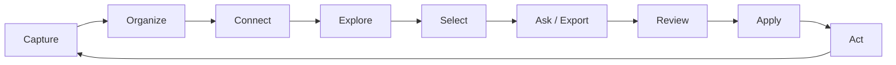

# Strata

Strata is a **local-first, encrypted, collaborative, AI-native spatial knowledge workspace** — a desktop
application for people who want their notes to live on their own disk, be readable without the app,
be selectively encrypted, and be usable as structured context for an AI assistant without silently
shipping their private material to a third party.

Strata is not a web app with an offline mode. It is a desktop app (PySide6 / Qt 6) with an embedded
React frontend that never talks to an origin server. There is no account, no sync backend, and no
telemetry by default.

---

## What Strata is

- **A workspace on disk.** A workspace is a directory. You can back it up, put it in Git, or copy it
  to a USB stick. Nothing is hidden in an opaque application database.
- **Layers, not one big vault.** A workspace is composed of **layers**. A *public layer* stores plain
  Markdown files you can read with any editor. A *private layer* stores independently encrypted
  objects with no plaintext names, no plaintext folder tree, and no plaintext index.
- **Spatial.** Notes, folders, tags, and relations form a graph you can explore in 3D
  (Three.js / react-three-fiber) with a 2D fallback for low-GPU and reduced-motion environments.
- **AI-native, not AI-dependent.** AI is a first-class surface (the **AI Context Composer**) but it
  operates on an explicit, visible selection of context, it never reads a locked layer, and every
  remote call produces a **privacy receipt**. Every AI change to your workspace is a **transactional
  operation plan**: preview, visual diff, approve, apply, undo.

## The product loop



| Step | What it means in Strata |
| --- | --- |
| **Capture** | Quick capture into a layer; Markdown editor (CodeMirror 6, from M2). |
| **Organize** | Folders, tags, properties, schemas, templates, database views. |
| **Connect** | Wiki links, typed relations, backlinks. |
| **Explore** | 3D/2D knowledge graph; **Knowledge Lens** = a saved multi-layer perspective. |
| **Select** | Choose objects, subgraphs, or a lens as context. |
| **Ask / Export** | AI Context Composer: selection + prompt + provider + export surface. |
| **Review** | Visual diff of the proposed operation plan; privacy receipt for remote calls. |
| **Apply** | Transactional apply, all-or-nothing, with undo. |
| **Act** | Tasks, saved views, snapshots — and back to capture. |

## Pillars

1. **Local-first.** The workspace is the source of truth. Offline is the default, not a degraded mode.
2. **Encrypted by design, honest about limits.** Per-layer keys, per-object AEAD, opaque filenames.
   We document exactly what a private layer leaks (see [THREAT_MODEL.md](THREAT_MODEL.md)).
3. **Legible storage.** Public layers are plain Markdown. Private layers are a documented byte format
   ([`docs/security/encryption-format.md`](docs/security/encryption-format.md)), not a proprietary blob.
4. **Spatial understanding.** The graph is a primary interface, not a novelty view.
5. **AI with consent.** Explicit context selection, structured output, preview-before-apply, receipts.
6. **No dark corners.** No telemetry by default, no crypto in JavaScript, no arbitrary code execution
   across the bridge, closed-enum errors, and a documented threat model that names what we do *not*
   defend against.

---

## Status

| | |
| --- | --- |
| **Version** | 0.1.0 (pre-alpha) |
| **Milestone 0 — Foundations** | Complete (repo scaffold, tooling, CI, packaging skeleton). |
| **Milestone 1 — Shell + bridge** | Complete (Qt shell, `strata://` scheme handler, QWebChannel bridge, request/response envelopes, error enum, JobBridge events). |
| **Milestone 2 — Editor & notes** | Next (CodeMirror 6, Markdown, public-layer note CRUD). |
| **Milestone 3 — Encryption** | Designed, not implemented. The format is specified now so it can be reviewed before code exists. |
| Roadmap / milestone tags | [PRODUCT_REQUIREMENTS.md](PRODUCT_REQUIREMENTS.md) — every FR carries an M0–M11 tag. |

**Nothing in this repository has been security-audited.** Do not store material whose disclosure would
seriously harm you in Strata until the encryption layer (M3) is implemented, reviewed, and audited.

---

## Development

> The commands below are maintained by the engineer owning the build system. The block is
> machine-marked; do not reformat it, and do not document commands anywhere else.

<!-- COMMANDS:START -->

Every command below has been run on Windows 11 with Python 3.10.11 and Node 24.

**Bootstrap** (once):

```powershell
python -m venv .venv
.\.venv\Scripts\python.exe -m pip install -e ".[dev]"

# Extracts qwebchannel.js from Qt's own resources into frontend/public/, so the
# page loads it from its own origin under `script-src 'self'` (no `qrc:` in the CSP).
.\.venv\Scripts\python.exe scripts\sync_qwebchannel.py
.\.venv\Scripts\python.exe scripts\make_icons.py

npm --prefix frontend ci
```

**Run the app** (production mode — loads the bundled frontend over `strata://`):

```powershell
npm --prefix frontend run build      # required: without frontend/dist the window is blank
.\.venv\Scripts\python.exe -m app.main
```

**Develop** (Vite hot-reload *and* the real Python bridge — dev mode does not mock Python):

```powershell
.\scripts\dev.ps1
```

**Every gate CI runs**, in one command:

```powershell
.\scripts\check.ps1          # add -Fix to apply formatting rather than only check it
```

…or individually:

```powershell
# Python
.\.venv\Scripts\python.exe -m ruff check app tests scripts
.\.venv\Scripts\python.exe -m ruff format --check app tests scripts
.\.venv\Scripts\python.exe -m mypy app
$env:QT_QPA_PLATFORM="offscreen"; .\.venv\Scripts\python.exe -m pytest tests/unit tests/integration tests/security -q

# Frontend
npm --prefix frontend run typecheck
npm --prefix frontend run lint
npm --prefix frontend run format:check
npm --prefix frontend test
npm --prefix frontend run build

# The desktop shell itself: loads the real bundle in Qt WebEngine and round-trips
# a WebChannel call into Python. Needs frontend/dist to exist.
$env:QT_QPA_PLATFORM="offscreen"; .\.venv\Scripts\python.exe -m pytest tests/e2e -q

# Private storage must never contain plaintext (self-test until Milestone 3 lands)
.\.venv\Scripts\python.exe scripts\scan_plaintext.py --self-test
```

**Package** (build on the platform you are targeting — PyInstaller does not cross-compile):

```powershell
# Windows: dist\Strata\Strata.exe, plus an installer if Inno Setup is on PATH
.\packaging\windows\build.ps1 -Installer
```

```bash
# Ubuntu / Linux
./packaging/linux/build.sh --appimage --deb
```

<!-- COMMANDS:END -->

### Requirements

| | |
| --- | --- |
| Python | 3.10+ (dev machine is 3.10.11; CI matrixes 3.10–3.12 — see [A-001](ASSUMPTIONS.md)) |
| Node | For frontend build only (Vite); the shipped app contains no Node runtime. |
| OS | Windows 11 is the primary dev target; macOS/Linux are supported targets but not yet validated. |

---

## Repository layout

```
strata/
├── app/                          # Python application (PySide6)
│   ├── main.py                   # entry point (`strata` console script)
│   ├── shell/                    # QMainWindow, QWebEngineView, strata:// scheme handler
│   ├── bridge/                   # QWebChannel bridge objects (one QObject per feature)
│   │   ├── envelope.py           # request/response envelope + closed error enum
│   │   ├── workspace_bridge.py
│   │   ├── layer_bridge.py
│   │   ├── notes_bridge.py
│   │   ├── graph_bridge.py
│   │   ├── search_bridge.py
│   │   ├── ai_composer_bridge.py
│   │   ├── export_bridge.py
│   │   ├── collaboration_bridge.py
│   │   ├── settings_bridge.py
│   │   ├── snapshot_bridge.py
│   │   └── job_bridge.py         # progress/events pushed via Qt Signal (JSON)
│   ├── core/                     # domain models (pydantic v2), workspace, layers, objects
│   ├── crypto/                   # M3: Argon2id, XChaCha20-Poly1305, envelopes, zeroization
│   ├── storage/                  # on-disk layout, atomic writes, trash, snapshots
│   ├── search/                   # FTS + vector index (ephemeral-first for private layers)
│   ├── graph/                    # networkx graph construction
│   ├── ai/                       # providers, context composer, operation plans, receipts
│   └── jobs/                     # background job runner
├── frontend/                     # React 18 + TypeScript (strict) + Vite
│   ├── src/
│   └── dist/                     # built bundle, served at strata://app/index.html
├── docs/
│   ├── architecture/
│   │   ├── system-architecture.md
│   │   └── storage-layout.md
│   ├── security/
│   │   └── encryption-format.md
│   ├── product/
│   │   └── glossary.md
│   └── adr/                      # architecture decision records
├── scripts/
│   └── scan_plaintext.py         # CI guard: no plaintext may appear in a private layer
├── tests/
│   ├── unit/
│   ├── integration/
│   ├── security/
│   ├── e2e/
│   ├── performance/
│   └── fixtures/
└── pyproject.toml
```

---

## Documentation

| Document | What it covers |
| --- | --- |
| [PRODUCT_REQUIREMENTS.md](PRODUCT_REQUIREMENTS.md) | Numbered FRs/NFRs with milestone tags and performance targets. |
| [ASSUMPTIONS.md](ASSUMPTIONS.md) | Security-first defaults chosen without asking, with rationale and how to revisit. |
| [THREAT_MODEL.md](THREAT_MODEL.md) | Assets, trust boundaries, adversaries, ~28 threats with STRIDE + status + residual risk. |
| [SECURITY.md](SECURITY.md) | Posture, reporting, supported versions, non-negotiable rules, supply-chain plan. |
| [CONTRIBUTING.md](CONTRIBUTING.md) | Dev setup, coding rules, Definition of Done, test layout. |
| [docs/architecture/system-architecture.md](docs/architecture/system-architecture.md) | Containers, bridge protocol, key hierarchy, AI operation-plan flow. |
| [docs/architecture/storage-layout.md](docs/architecture/storage-layout.md) | Exact on-disk trees for public and private layers. |
| [docs/security/encryption-format.md](docs/security/encryption-format.md) | Byte-level container spec, AAD, padding, KDF, rotation, migration. |
| [docs/product/glossary.md](docs/product/glossary.md) | Canonical terminology. Use these words. |

## What Strata does not claim

- Not "zero knowledge" — the app runs on your machine and holds your keys while unlocked.
- Not "military-grade encryption" — it is XChaCha20-Poly1305 and Argon2id, used carefully, and that
  is what we will call it.
- Not resistant to local malware or a compromised OS while a layer is unlocked. That is explicitly
  out of scope; see [THREAT_MODEL.md](THREAT_MODEL.md).

## License

Proprietary (see `pyproject.toml`). Licensing is a recorded open question — see
[A-013](ASSUMPTIONS.md).
