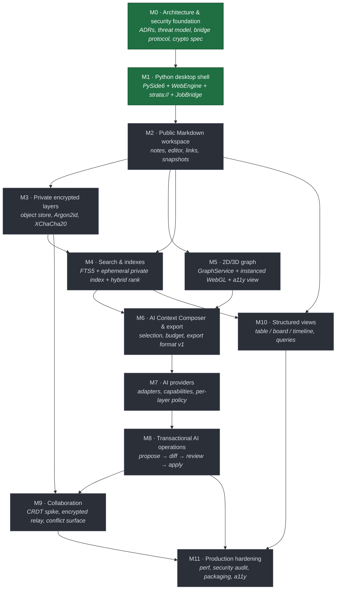

# Strata — Roadmap

**Last updated:** 2026-07-14

Strata is a local-first, encrypted, collaborative, AI-native spatial knowledge workspace: a PySide6 +
Qt WebEngine desktop application with a React frontend, an encrypted object store, a 2D/3D knowledge
graph, and an AI layer that never sends anything anywhere without being told to.

This roadmap is a plan, not a promise. Dates are absent on purpose — the milestones are ordered by
dependency, and each one has **exit criteria** that are either met or not. A milestone is not "done"
because time passed.

## Status

| Milestone | Title | Status |
| --- | --- | --- |
| **M0** | Architecture & security foundation | ✅ **Complete** |
| **M1** | Python desktop shell | ✅ **Complete** |
| M2 | Public Markdown workspace | Planned |
| M3 | Private encrypted layers | Planned |
| M4 | Search & indexes | Planned |
| M5 | 2D/3D graph | Shipped (v0.1.0) |
| M6 | AI Context Composer & export | Planned |
| M7 | AI providers | Planned |
| M8 | Transactional AI operations | Planned |
| M9 | Collaboration | Shipped (v0.2.0) |
| M10 | Structured views | Planned |
| M11 | Production hardening | Planned |

## Dependencies

The two structural facts in that graph:

- **M3 (encryption) gates M9 (collaboration)** — you cannot end-to-end-encrypt a collaboration protocol
  before you have the key hierarchy it rides on.
- **M8 (transactional AI) gates M11 (hardening)** and is the *real* prompt-injection defence
  (ADR-0008 §8.4). Nothing else in the AI stack ships to production without it.

## Definition of Done

Every milestone below references **the DoD checklist**. A milestone is complete only when *every*
applicable item passes. This is the checklist:

- [ ] **Tests.** Unit tests for all new services; integration tests across the bridge; golden-file tests
      where a format is involved. Coverage does not regress.
- [ ] **Types.** `mypy --strict` clean on Python (3.10 target, ADR-0011); `tsc --strict` clean on the
      frontend. No new `# type: ignore` or `any` without a comment explaining why.
- [ ] **Lint.** `ruff` and `eslint` clean, no suppressions added.
- [ ] **Security.** The milestone's threat-model entries are written or updated. No new secret crosses
      the bridge. No new plaintext at rest for private content. Every new bridge slot has request **and**
      response Pydantic validation and is in the capability inventory (ADR-0003).
- [ ] **Errors.** Every failure path maps to a closed error code (ADR-0003). No stack traces or paths in
      production error payloads.
- [ ] **Async.** Nothing that can exceed ~100 ms runs on the Qt main thread. It is a job (ADR-0003), it
      reports progress, and it is cancellable.
- [ ] **Accessibility.** Keyboard-navigable, screen-reader-legible, honours `prefers-reduced-motion`. Any
      feature that only exists in the 3D view is not done (ADR-0010).
- [ ] **Performance.** The milestone's stated performance targets are measured on the reference machine,
      not estimated, and the numbers are recorded.
- [ ] **Docs.** ADRs written for any architecturally significant decision; user-facing behaviour
      documented; anything deferred is named, justified, and assigned to a milestone.
- [ ] **Packaging.** The app still builds, bundles, and launches on Windows, macOS, and Linux.

---

## M0 — Architecture & security foundation ✅ Complete

**Goal.** Decide the things that are expensive to change later, write them down, and make them
falsifiable — before any of them is load-bearing.

**Scope.**
- The eleven ADRs (`docs/adr/0001`–`0011`): host, frontend, bridge protocol, object storage, crypto
  primitives, CRDT, search, AI providers, export format, graph, Python version.
- `THREAT_MODEL.md` — assets, adversaries, trust boundaries, and an **honest** leakage list (ADR-0004
  §"Leakage" is the reference for what "honest" means here: object count, bucketed sizes, mtimes, total
  size, existence of the layer, and an activity trace for an attacker watching a sync folder).
- `SECURITY.md` — the security policy, disclosure process, and what we *do not* protect against.
- The normative export-format specification (`docs/export-format/README.md`).
- Repository skeleton, `pyproject.toml`, CI matrix (3.10/3.11/3.12), lint/type/test gates.

**Exit criteria.**
- Every ADR is Accepted, with concrete parameters an engineer can implement without asking a question.
- The threat model names what an attacker with the encrypted directory learns, and does not overclaim.
- The export format is precise enough that two engineers would write byte-identical exporters from it.
- CI is green on all three Python versions.

**Key risks (and where they landed).**
- *Deciding the CRDT before we can test it.* → Accepted, and ADR-0006 is marked **provisional** with a
  named M9 spike and named exit criteria. This is the honest way to make a decision you cannot yet
  validate.
- *Over-specifying, then discovering the spec was wrong.* → Mitigated by naming what is deferred (M9
  chunked manifest, M4 encrypted persistent index, M5's 100k layout engine) rather than pretending it is
  decided.

**DoD.** Docs, security, and CI items apply. ✅

---

## M1 — Python desktop shell ✅ Complete

**Goal.** A running application: a Qt window, a React app inside it, and a bridge between them that is
already the *real* bridge — validated, capability-scoped, job-based — not a prototype to be replaced.

**Scope.**
- `QApplication` lifecycle, main window, single-instance, graceful shutdown (which zeroizes what it can).
- `QWebEngineUrlScheme` **`strata://`** registered *before* `QApplication` (secure + local +
  CORS-enabled), with a scheme handler serving the bundled `frontend/dist`, and a **strict CSP**
  (`connect-src 'self'` — the renderer has no network) (ADR-0003).
- `QWebChannel` with the feature-scoped bridge objects, the `@bridge_slot` decorator (parse → validate →
  dispatch → validate → serialise), the JSON envelope, the closed error enum, the 1 MiB payload cap.
- **`JobBridge`** and the worker model: `QThreadPool` / `multiprocessing` workers, `jobEvent` signal,
  cooperative cancellation. This is the *only* async mechanism in the app.
- React 18 + TS strict + Vite; the bridge client with request-id correlation and job-event routing;
  Python→TypeScript type generation from the Pydantic models.
- PyInstaller build producing a launchable artefact on all three platforms.
- Structured logging with a **redaction filter on the handler** (not at call sites).

**Exit criteria.**
- The app launches, shows a React UI, and a round-trip bridge call succeeds with full validation on both
  sides.
- A deliberately malformed envelope returns `invalid_request` and never reaches a service.
- A 2 MiB payload returns `payload_too_large` before parsing.
- A long job reports progress, can be cancelled, and cancelling actually stops the work.
- The release build asserts its page origin is `strata://` and refuses to start otherwise.
- Bundled artefact launches on Windows, macOS, and Linux from a clean machine.

**Key risks (and where they landed).**
- *Custom-scheme registration ordering* (must precede `QApplication`) → asserted at startup; a
  regression fails immediately and loudly rather than degrading to a weak origin.
- *PyInstaller + QtWebEngine* (resource paths, helper-process signing on macOS) → this was the single
  biggest time sink, as ADR-0001 predicted. It is a permanent CI maintenance cost.
- *Bridge boilerplate becoming intolerable* → the `@bridge_slot` decorator is what makes ADR-0003's
  rigour survivable. If it had not worked, the protocol would have been eroded by convenience.

**DoD.** All items apply. ✅

---

## M2 — Public Markdown workspace

**Goal.** A genuinely good, unencrypted, local Markdown notes app. Everything after this is built on
it — including the encrypted store, which is the same product with a different `LayerStore`.

**Scope.**
- Workspace open/create; the **layer** concept (public layers = plain Markdown on disk, real filenames,
  readable by any other tool — that is their whole point).
- Note CRUD, folders, tags, YAML frontmatter properties, attachments.
- **CodeMirror 6** editor: Markdown, wiki-links `[[note]]`, Markdown links, backlinks panel, autocomplete
  on link, unresolved-link handling.
- `LinkService` in Python (extraction, resolution, backlinks) — **the single implementation** that
  search (M4), the graph (M5), and export (M6) all consume (ADR-0010).
- File watching and external-edit reconciliation (a public layer *will* be edited by another tool; that
  must not corrupt state or lose data).
- **Snapshots** and history (`SnapshotBridge`), restore, diff view.
- Command palette; the app shell (panels, tabs, keyboard model).

**Exit criteria.**
- Create, edit, link, and navigate 1,000 notes with no perceptible lag.
- Files on disk are ordinary Markdown that Obsidian/VS Code/`grep` can read and edit; an external edit is
  picked up without data loss.
- Backlinks are correct, including for renamed and unresolved links.
- A snapshot can be taken, browsed, diffed, and restored.
- Editor is fully keyboard-operable and screen-reader-legible.

**Key risks.**
- **External-edit reconciliation is harder than it looks.** File watchers are unreliable (network
  drives, macOS FSEvents coalescing, editors that write-then-rename), and a bad reconciliation loses the
  user's work. Mitigate with content hashing, conflict copies rather than overwrites, and a bias toward
  *never* discarding bytes.
- **Link semantics are a contract**, and changing them later breaks the graph, search, and export at
  once. Get `LinkService` right here, or pay three times.
- Scope creep. M2 is where "just one more editor feature" eats a quarter.

**DoD.** All items apply.

---

## M3 — Private encrypted layers

**Goal.** The security core. A private layer whose directory, handed to an attacker, tells them almost
nothing — and which behaves, when unlocked, exactly like a public one.

**Scope.**
- The **object store** (ADR-0004): random 16-byte opaque ids → `objects/<2hex>/<32hex>`, no extensions,
  no plaintext names, padding buckets, atomic writes, GC of unreferenced objects.
- The **encrypted manifest** — all structure lives here; retained manifest history so a corrupt manifest
  is recoverable (this is the single point of failure ADR-0004 names, and the mitigation ships *with*
  the feature, not after it).
- **Crypto** (ADR-0005): Argon2id (t=3, m=256 MiB, p=4, versioned params in `layer.header`) → KEK →
  wraps a random 256-bit LDK; XChaCha20-Poly1305 with random 24-byte nonces and AAD binding
  `{fmt, layer_id, object_id, type}`; optional recovery key wrapping the same LDK.
- Lock/unlock as a **job** with progress (Argon2id takes 0.5–1.5 s and 256 MiB, on a worker, ADR-0001).
- Key lifecycle: keys never cross the bridge, never hit disk unwrapped, never appear in a log, dropped
  and overwritten on lock.
- Attachment streaming for private layers via the `strata://` scheme handler (decrypt on the fly for an
  unlocked layer; refuse for a locked one).
- The `LayerStore` interface, with public (plain files) and private (object store) implementations, so
  that M2's entire feature set works over an encrypted layer with no feature-level changes.

**Exit criteria.**
- A private layer's directory contains no plaintext, no filenames, no extensions, no structure. A
  reviewer with the directory and no password can state exactly what they learned, and it matches
  ADR-0004's leakage list.
- Unlock → full workspace functionality; lock → the layer is inert (no cached plaintext, no index, no
  graph nodes, nothing in memory we can drop and did not).
- Wrong password fails cleanly and at Argon2id speed (no fast-path oracle).
- Recovery key unlocks the layer. Password change rewrites only `layer.header`.
- Tampering with any object (bit flip, swap two objects' bytes, move an object between layers, replace
  the manifest with another layer's) is **detected** — the AAD binding is tested adversarially, not just
  happy-path.
- Kill the process mid-write; the store is consistent on restart.

**Key risks.**
- **The manifest single point of failure.** Corrupt it and the layer is a bag of unattributed ciphertext.
  The retention + atomic-write mitigation is not optional and is an exit criterion.
- **Key material in Python memory cannot be reliably erased.** Stated honestly in ADR-0005 and
  THREAT_MODEL; not solvable, only bounded.
- **Full manifest rewrite is O(n).** Fine here, hostile at M9 scale. The M9 chunked design is documented
  now so M3's code does not assume "the manifest is one blob you load whole".
- **Object replay/rollback is not prevented by AEAD alone** (an old backup can revert an object). Known
  gap, deferred to M11's integrity anchor, and written down rather than hidden.

**DoD.** All items apply. Security items are the milestone.

---

## M4 — Search & indexes

**Goal.** Fast, good, explainable search that a locked layer contributes **nothing** to.

**Scope.**
- **Per-layer indexes, never shared** (ADR-0007). Public: SQLite FTS5 at `index.sqlite`. Private:
  **ephemeral in-memory index rebuilt on unlock**, `PRAGMA temp_store = MEMORY`, dropped on lock.
- Cross-layer query = fan-out + merge over *currently searchable* layers, with per-signal score
  normalisation.
- **Hybrid ranking:** BM25 (lexical) + cosine (semantic) + graph proximity + property/tag match +
  recency, query-adaptive weighting.
- **"Why this matched"** — per-signal contributions surfaced in the UI. Not a debug feature; the feature.
- Embeddings as private content: in-memory NumPy matrix while unlocked; local embedding model by default
  for private layers; **never** sent to a remote embedding provider unless the layer's policy allows it.
- Facets, autocomplete, snippets — all of which respect the locked-layer rule.
- The **optional** encrypted persistent index for very large private layers: opt-in, per-layer, with the
  security-downgrade warning in ADR-0007 §4 shown verbatim. *Its shard/padding scheme gets its own spec
  before it ships, and it does not ship if we cannot characterise its leakage as precisely as the object
  store's.*

**Exit criteria.**
- 10k-note private layer: index rebuild on unlock **≤ 3 s** on the reference machine, on a worker, with
  progress, and search is honestly reported as unavailable-for-that-layer until it completes.
- A locked layer contributes **zero**: no results, **no counts**, no facets, no autocomplete terms, no
  snippets, no graph hints, no contribution to global stats. Tested adversarially, term by term.
- No index artefact for a private layer exists on disk (unless the opt-in is enabled). Verified by a test
  that greps the whole workspace directory for known plaintext terms after a lock.
- Search latency p95 < 100 ms on a 10k-note corpus.
- "Why this matched" is present on every result.

**Key risks.**
- **A shared index is the tempting design and it is a total confidentiality break** (one missed `WHERE`
  clause). ADR-0007 rejects it explicitly; the risk is that someone reintroduces it for performance.
- **The unlock-session cache is exactly the kind of optimisation that silently destroys the property.**
  A lock is always a privacy lock. Called out in ADR-0007 so it is caught in review.
- Hybrid ranking has no ground truth. Needs an evaluation set of realistic queries or it will be tuned by
  vibes.
- Memory: an unlocked 50k-note layer holds its index and a ~150 MB embedding matrix. Several at once is a
  real footprint, and it bounds the ephemeral design.

**DoD.** All items apply.

---

## M5 — 2D/3D graph

**Goal.** The spatial view. Fast, legible, and with a first-class accessible equivalent.

**Scope.**
- **`GraphService` (Python)** — the model: nodes, edges, weights, clusters (Louvain/Leiden), centrality,
  orphans, filters. Feeds M4's graph-proximity signal and M6's Graph Summary. **One implementation of
  "what a link is"** (ADR-0010).
- **Rendering (TS)** — Three.js + react-three-fiber; nodes as a single `InstancedMesh`; edges as batched
  `LineSegments` / instanced quads; GPU picking; SDF labels. **Per-frame updates bypass React.**
- **Layout in a Web Worker** — d3-force, incremental and interruptible, positions streamed back as a
  `Float32Array`. The worker interface is engine-agnostic so the 100k engine can be swapped in later.
- LOD, viewport culling, **cluster aggregation** (you never render 100k nodes; you render clusters and
  drill in).
- **2D = the same pipeline** with an orthographic camera. Canvas2D fallback for no-WebGL machines.
- **Low-GPU mode** and **reduced-motion mode** (no animated simulation, no camera easing — a genuine
  accessibility requirement, not a preference).
- **The accessible tree/list view** — a peer view in the same switcher, fully keyboard- and
  screen-reader-navigable, with the same filters, selection model, and composer integration. **Shipping
  requirement for M5, not a follow-up.**
- Position persistence per layer (encrypted, as an object, for private layers — a graph layout is a
  picture of your knowledge structure).

**Exit criteria.**
- **1,000 nodes at 60 fps** with labels and edges, on the reference machine.
- **10,000 nodes usable** with clustering; frame time ≤ 16 ms on the reference *low-GPU* machine.
- 100k: **navigable via progressive aggregation** — honestly, this is where M5 delivers the *pipeline*
  and M11 delivers the *performance*. Stated plainly rather than promised.
- Everything achievable in the 3D view is achievable in the accessible view.
- A locked layer contributes no nodes and no edges.
- `prefers-reduced-motion` produces a static, non-animated layout.

**Key risks.**
- **Instanced rendering is hard to write and easy to erode.** "Just add a Mesh for this one thing" will
  be proposed, repeatedly, and it must be refused in review.
- **The React/Three boundary is a discipline, not a guarantee.** A `setState` at frame rate will happen;
  a dev-build frame-budget assertion is the tripwire.
- **Force-directed layouts are unstable** — users form spatial memory and will (rightly) hate it when the
  graph rearranges. Seeded RNG + position persistence + reheat-not-restart mitigates; it does not solve.
- The accessible view is the item most likely to be quietly cut under schedule pressure. It is an exit
  criterion so that cutting it means failing the milestone.

**DoD.** All items apply. Accessibility items are the milestone.

---

## M6 — AI Context Composer & export

**Goal.** Turn a selection of knowledge into a context bundle the user can *read before it leaves*.

**Scope.**
- **Selection**: notes, folders, tags, graph neighbourhoods (n-hop from a node), search results, manual
  add/remove. Selection is a first-class object, savable and re-runnable.
- **Budget estimation** against a target model (via `AIProvider.estimate_tokens`, ADR-0008), with the
  10% headroom rule when the estimate is not exact.
- **The exporter**, implementing `docs/export-format/README.md` **exactly**: frontmatter, the five fixed
  sections, `STRATA-SOURCE-###` ids, the Mermaid Graph Summary (with the 60-node cap and the adjacency-table
  fallback), the Source Index, the three presets, the multi-file package, `MANIFEST.json` + its JSON
  Schema.
- **Deterministic splitting** into `context-part-00N.md` + `context-index.md`. **Never silent
  truncation** — if it does not fit, the user is told and shown the split.
- **The privacy flow**: locked layers cannot be exported (by construction — the export path has no key);
  private inclusion requires explicit per-export confirmation naming the layers; **every included private
  source is previewed as actual text**, not as a count.
- Copy-to-clipboard, save-to-disk, and (once M7 lands) send-to-provider — all from the same composed
  bundle.

**Exit criteria.**
- All eight conformance tests in the export spec §11 pass: determinism (byte-identical), preset
  equivalence (same `(id, content_hash)` set across presets), no truncation (parts reassemble to the
  sources exactly), locked-layer refusal, private-confirmation enforcement, no internal identifiers
  anywhere in any artefact, adversarial escaping (a note containing `</source>`, a fence, and a forged
  `### STRATA-SOURCE-999` line does not break any preset), schema validity.
- A user can read the full text of every private source before anything is written or sent.
- Golden-file corpus in CI.

**Key risks.**
- **Silent truncation is the worst failure mode in the product** — it produces a confidently wrong answer
  with no signal. The spec forbids it; the tests must actually prove it.
- Token estimation is approximate for local models; conservative splitting is the required error
  direction.
- Mermaid degrades badly past a few dozen nodes; the cap and the table fallback are not optional polish.
- The preview flow is the privacy feature and it is also the most tedious UI in the milestone. It will be
  tempting to reduce it to a list of titles. That is the failure this milestone exists to prevent.

**DoD.** All items apply.

---

## M7 — AI providers

**Goal.** Talk to models — local and remote — under a per-layer policy the UI cannot bypass.

**Scope.**
- The **`AIProvider` Protocol** (ADR-0008): `list_models`, `capabilities`, `health_check`,
  `estimate_tokens`, `stream`, `create_embeddings`. `stream` is the only completion entry point.
- Adapters: **OpenAI** (Responses API), **Anthropic** (Messages API), **Ollama**, **llama.cpp server**,
  **LM Studio**, **generic OpenAI-compatible**, and the **Claude CLI process adapter**.
- The Claude CLI adapter's hardening, all of it non-optional: `shell=False` with an argument list, prompt
  on **stdin** never argv, restricted ephemeral cwd (not the workspace), allowlisted environment,
  timeout with hard process-group/job-object kill, cancellation wired to `JobBridge.cancel`, explicit
  binary resolution (no `PATH` re-resolution at call time). **It is not an offline model** — it calls the
  cloud, it is `local: False`, and the UI says so.
- **Capability profiles gate the UI.** No tools UI for a model without tools. No vision drop zone without
  vision. Not disabled-with-a-tooltip: absent.
- **Per-layer AI policy** (`off | local_only | ask | allow`), enforced in **`AIService`**, at request
  assembly, **not in the UI**. Strictest source layer wins. A `local_only` layer's content reaching a
  cloud provider is `permission_denied`, loudly — not silently corrected.
- **Privacy-aware router** (optional, off by default): may downgrade remote→local freely; **will never
  silently move a request from local to remote**, for any reason, including local failure. A failed local
  call surfaces as a failure with a *"try with <cloud provider>?"* affordance. It does not fall back.
- **Credentials in the OS keychain only** (`keyring`). Never a config file, never an env var we write,
  never a log, never a bridge payload. The renderer sees `{"hasKey": true}` and nothing else. Where the
  keychain is unavailable, we refuse to store rather than fall back to a file.
- **Prompt-injection defences** (ADR-0008 §8): structural instruction/data separation via the export
  format's source blocks, delimiter escaping, tool gating with per-action confirmation, no renderer
  egress (`connect-src 'self'`), model output rendered as sanitised Markdown never raw HTML, policy
  checked at assembly not at render.
- Streaming into the UI (`JobBridge` `partial` events), token accounting, cancellation that actually
  kills the request.

**Exit criteria.**
- All seven adapters pass a common conformance suite (stream, cancel, error mapping, capability report,
  health check).
- **A `local_only` layer's content cannot reach a cloud provider.** Proven by a test that constructs the
  request directly at the service layer, bypassing the UI entirely, and asserts `permission_denied`.
- No API key appears in any log, any error payload, any config file, or any bridge message. Proven by a
  scanner over captured logs and bridge traffic in the integration suite.
- The Claude CLI adapter cannot be induced to run a shell, read the workspace directory, or outlive its
  timeout. Tested adversarially.
- Cancelling a stream stops the network request and, for the CLI adapter, kills the process.

**Key risks.**
- **Seven adapters against APIs that change without warning** is permanent maintenance. If we cannot test
  an adapter, we cut it rather than ship one we cannot vouch for.
- **Capability drift**: our table is a snapshot of a moving world. `list_models`/`health_check` pull what
  they can; the static table is the fallback, not the truth.
- **The subprocess adapter is an attack surface** that hardening bounds but does not remove.
- **Prompt injection is not solved by this milestone.** Structural separation raises the bar. The defence
  with teeth is M8, and M7 must not ship an AI write path that bypasses it.

**DoD.** All items apply.

---

## M8 — Transactional AI operations

**Goal.** The AI can *propose* changes to the workspace. It can never *make* them. This is the real
prompt-injection defence and the reason an injected "delete everything tagged confidential" produces a
diff the user rejects rather than a data loss the user discovers.

**Scope.**
- **Propose → diff → review → apply.** Every AI-originated mutation (create, edit, move, retag, link,
  delete, bulk operations) is materialised as a **proposed change set**, rendered as a reviewable diff,
  and applied only on explicit user confirmation of the *specific* actions.
- Change sets are **atomic**: apply-all or apply-none (with per-item accept/reject before applying). A
  partial application never leaves the workspace inconsistent.
- **Undo** of an applied change set, as a unit, via the snapshot system.
- Tool-calling wired to this: a model's tool call does not execute a mutation; it *contributes to a
  change set*. Read-only tools (search the workspace, read a note the policy permits) may execute
  directly; anything that writes cannot.
- Bulk operations with a **preview and a blast-radius summary** ("this will modify 47 notes across 2
  layers, 12 of them private").
- Per-layer policy is checked at *apply* as well as at *propose* — a layer locked between proposal and
  application makes the apply fail, not partially succeed.

**Exit criteria.**
- **No AI code path writes to the workspace without an applied change set.** Proven by an architectural
  test (the mutation APIs are unreachable from `AIService` except through `ChangeSetService`).
- An adversarial fixture — a note containing an injected instruction to delete or exfiltrate — produces,
  at worst, a change set the user can see and reject. Tested end-to-end with a real model in the loop.
- Apply is atomic under crash: kill the process mid-apply, and on restart the workspace is either fully
  before or fully after.
- Undo restores exactly.

**Key risks.**
- **The friction is the point, and it will be reported as a papercut.** Users will ask for
  "auto-apply for trusted operations". That is the request to refuse.
- Diff rendering for structural changes (moves, retags, link rewrites) is much harder than text diffs and
  will be underestimated.
- A model that proposes a 200-note change set produces a diff nobody reads, which is confirmation theatre.
  The blast-radius summary and sensible batching are what stop that — and they are hard to get right.

**DoD.** All items apply.

---

## M9 — Collaboration

**Goal.** Two or more people editing the same layer, offline-capable, with **no server that can read
anything**.

**Scope.**
- **The CRDT validation spike, first, timeboxed 2 weeks** (ADR-0006). Exit criteria are in the ADR and
  they are real: `pycrdt` ↔ JS Yjs wire interop over our bridge, three peers with one offline for an
  hour converging on a 5,000-note layer with no data loss, a 10,000-update backlog merging in < 2 s off
  the main thread, all three conflict classes detectable post-merge, compacted document within ~2× the
  plaintext corpus, and `pycrdt` still maintained. **If the spike fails, ADR-0006 is superseded and
  Automerge is the first alternative.** The conflict-surface design transfers unchanged.
- Yjs semantics via `pycrdt`: `Y.Text` for note bodies (bound to CodeMirror via `y-codemirror.next`),
  `Y.Map` for note metadata, **`Y.Map` of parent pointers** for the folder tree.
- **The explicit conflict surface** — the actual product decision here. Move cycles, move-vs-delete, and
  edit-vs-delete are **rescued, not silently merged**: cycle members and orphans are re-parented into
  `Conflicts/`, a `ConflictRecord` is written, and the UI explains what happened in human terms
  ("Bob deleted *Research* while you moved *Interview notes* into it. The note is safe, in Conflicts/.").
  **We never lose data to a merge.**
- **Encrypted update transport**: every CRDT update is sealed with XChaCha20-Poly1305 under the LDK
  before it leaves the device (AAD binds `{fmt, layer_id, doc_id, seq}`). The relay is a dumb forwarder
  of ciphertext and sees blob sizes, timing, and pseudonymous peer identities — **and nothing else**.
- **Identity**: X25519/Ed25519 peer keys (ADR-0005), sealed under the workspace passphrase. The session
  key-agreement protocol gets its **own ADR** in this milestone — it is deliberately not pre-decided.
- Presence, remote cursors, and selections in CodeMirror.
- **Update compaction** — without it a Yjs document grows without bound. Compaction is a shipping
  requirement, not a later optimisation.
- The **chunked/CRDT manifest** (ADR-0004's deferred M9 item): the manifest becomes the CRDT document,
  persisted as chunked encrypted update objects, so a concurrent edit writes a small object instead of
  rewriting the whole manifest.

**Exit criteria.**
- The spike's six criteria, all of them.
- Three peers, one offline for an hour, converge with no data loss.
- The relay operator, given full access to the relay, can demonstrate that they learn nothing beyond blob
  sizes, timing, and pseudonymous peer ids. Verified by an adversarial review, not asserted.
- All three conflict classes are surfaced to the user with an actionable explanation, and **no case
  results in silently lost content**.
- Compaction bounds document growth on a realistic 6-month edit history.

**Key risks.**
- **`pycrdt` is a small project.** If it is abandoned we are maintaining a Rust-Python binding, which is
  not a skill the team has (ADR-0001 rejected Rust on exactly those grounds). The `CRDTStore` seam and
  the fact that the *wire format* is specified Yjs are the escape hatches; a JS sidecar is the ugly
  worst case.
- **Tombstones are a privacy issue, not just a size issue.** Deleted text persists in the document
  history until compaction. Users deleting sensitive content must be told this plainly, in the UI and in
  SECURITY.
- **"The CRDT merged successfully and my note disappeared"** is the failure this milestone exists to
  prevent. Convergence is not correctness.
- Public layers are explicitly **out of scope** for collaboration. Two people editing a public layer
  through a file-sync tool get whatever that tool does, and we say so rather than pretending.

**DoD.** All items apply. A new ADR (session key agreement) is required, and ADR-0006's provisional
status is resolved — to Accepted or to Superseded.

---

## M10 — Structured views

**Goal.** Notes are not only prose. Tables, boards, and timelines over the same data, driven by the same
properties.

**Scope.**
- **Table view** — rows are notes, columns are frontmatter properties; sortable, filterable, editable
  in place (an edit writes back to the note's frontmatter).
- **Board view** — kanban by any property.
- **Timeline view** — by any date property.
- A **query language** for defining a view's source set (a saved selection, in the same vocabulary the AI
  Context Composer uses — one selection model, not two).
- Property schemas: types (text, number, date, select, multi-select, checkbox, link), validation, defaults
  — with a migration story for when a schema changes under existing notes.
- Views are **projections**, computed from the store; they are not a second source of truth, and (for
  collaborative layers) they are **not** stored in the CRDT (ADR-0006).
- **Export import** (the deferred item from the export spec §12) — reading a Strata export back into a
  workspace. It lands here because its conflict/merge story overlaps M9's, and doing it earlier would
  mean doing it twice.

**Exit criteria.**
- A table view over 5,000 notes is virtualised and responsive (scroll at 60 fps, filter in < 100 ms).
- In-place edits round-trip to frontmatter without corrupting the note body — including notes whose
  frontmatter was hand-written by another tool.
- Views respect layer visibility and locking (a locked layer contributes no rows — the M4 rule, applied
  here).
- Fully keyboard-navigable and screen-reader-legible. A table is a place where accessibility is easy to
  get right and easy to get catastrophically wrong.

**Key risks.**
- **Frontmatter is user data and other tools own it too.** Writing back to it must be conservative:
  preserve key order, preserve comments where possible, never reformat what we did not change.
- Property-schema migration is a data-integrity problem wearing a UI problem's clothes.
- The query language is a scope hazard. Keep it small, keep it the same one the composer uses, resist
  building a database.

**DoD.** All items apply.

---

## M11 — Production hardening

**Goal.** Ship it. Meaning: it is fast, it is audited, it installs, it updates, it is accessible, and the
known gaps are closed or honestly documented.

**Scope.**
- **Performance:** the 100k-node graph target via the faster layout engine (WASM/WebGPU — the spike ADR-0010
  defers to here); search at 100k notes (an in-memory ANN index over the same NumPy matrix, if the
  brute-force matmul has stopped being free); startup time; memory under several unlocked layers.
- **The M3 integrity gap (ADR-0005):** object replay/rollback. A monotonic manifest version plus an
  integrity anchor the attacker cannot roll back (a signed head in the OS keychain, checked at unlock,
  warning loudly on regression). **This is a named, deferred gap and M11 is where it is closed.**
- **External security audit.** Threat model, crypto implementation, bridge surface, subprocess adapter,
  supply chain. Findings are release-blocking.
- **Supply chain:** lockfile pinning, dependency review, SBOM, reproducible builds where achievable.
  (ADR-0003 notes that every frontend dependency is inside the trust boundary — this is where that is
  taken seriously.)
- **Packaging & signing:** Windows (signed installer), macOS (notarised, and the QtWebEngine helper
  process signed correctly — the thing that will break), Linux (AppImage/Flatpak).
- **Auto-update**, with signature verification. An update channel is a remote-code-execution channel into
  a process holding the user's keys; it gets the same scrutiny as the crypto.
- **Accessibility audit** — the whole app, against WCAG 2.2 AA, by someone who is not us.
- **CJK/Thai/Arabic tokenisation** (ADR-0007's deferred item — the `unicode61`+trigram fallback is not
  good enough and a real segmenter is needed).
- Crash reporting that **cannot** exfiltrate content (no note text, no paths, no keys — a trace id and a
  stack, and the redaction filter proven by test).
- Onboarding, error copy, empty states, and the honest security messaging: what Strata protects, what it
  does not, and what an attacker with your encrypted directory learns.

**Exit criteria.**
- The performance targets in ADR-0007 and ADR-0010 are **measured** on the reference machines and
  recorded — not estimated.
- The external audit's findings are closed or accepted-with-rationale in THREAT_MODEL.
- The rollback/replay gap is closed, or it is documented as residual risk with a stated reason.
- Signed, notarised, installable artefacts on all three platforms, from CI, reproducibly.
- WCAG 2.2 AA audit passed.
- A crash report, captured from a real crash with a real workspace open, contains **no** user content.

**Key risks.**
- **macOS notarisation of the QtWebEngine helper process** will break, and it will break late. ADR-0001
  flagged it as a permanent CI cost; this is where it becomes a ship-blocker.
- **An audit late is an audit that finds architectural problems too late to fix.** Mitigation: the audit
  is scoped and booked *during M9*, not after M10, and the crypto/storage portion can be audited from M3
  onward — there is no reason to wait.
- **Auto-update is the highest-value target in the whole product.** Get it wrong and every user's keys are
  one compromised signing key away. It deserves its own ADR and its own review.
- Hardening milestones absorb every deferred item ever written. The list above is the scope; anything else
  is M12.

**DoD.** All items apply, and the DoD checklist itself is the release gate.

---

## Deferred items, and where they land

Nothing here is "TBD". Each is deliberately deferred, with a reason and a destination.

| Item | Deferred from | Why | Lands in |
| --- | --- | --- | --- |
| Chunked / CRDT manifest | M3 (ADR-0004) | Single-blob manifest is correct and simple for one user; chunking only pays off under concurrent edit. | M9 |
| Encrypted persistent search index | M4 (ADR-0007) | Needs a shard/padding scheme whose leakage we can characterise as precisely as the object store's. If we can't, it doesn't ship. | M4 (opt-in) / cut |
| 100k-node layout engine (WASM/WebGPU) | M5 (ADR-0010) | d3-force covers 1k–10k; the worker interface is engine-agnostic so this is a swap, not a rewrite. | M11 |
| Object replay / rollback protection | M3 (ADR-0005) | Needs an integrity anchor outside the workspace (keychain-stored signed head). A known, documented gap until then. | M11 |
| Session key-agreement protocol | M0 (ADR-0005) | Fixing the primitive family (X25519/Ed25519) now is enough; the protocol needs the collaboration design to exist first. | M9 (own ADR) |
| Export **import** | M6 (export spec §12) | Needs a conflict/merge story that overlaps M9's CRDT work. | M10 |
| Signed exports | M6 (export spec §12) | Needs the M9 identity keys. | M9+ |
| Attachment content extraction (OCR/PDF text) | M6 (export spec §12) | Extracted text *is* content, with its own privacy questions. Needs its own design. | M11 |
| CJK/Thai/Arabic tokenisation | M4 (ADR-0007) | The trigram fallback is a hack and we know it. | M11 |
| Third-party AI provider plugins | M7 (ADR-0008) | A plugin needs a real trust model, not just a Protocol. | Post-M11, own ADR |
| ANN index for >100k-note semantic search | M4 (ADR-0007) | Brute-force cosine is free at 10k and fine at 50k. | M11 |
