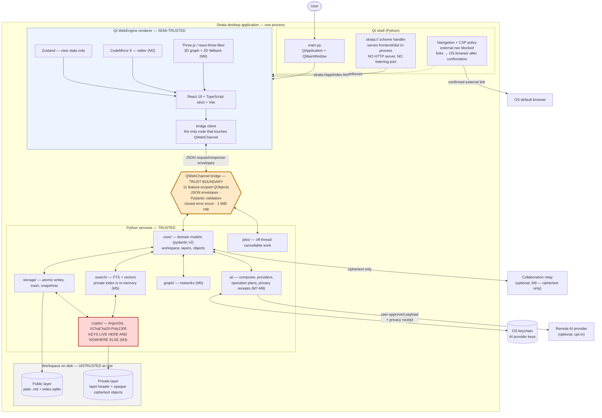
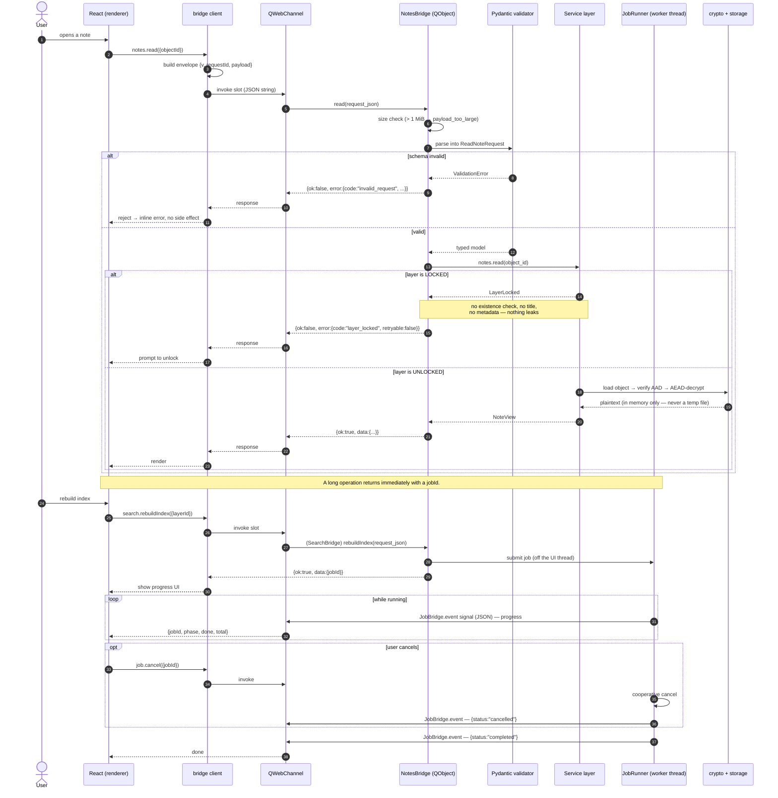
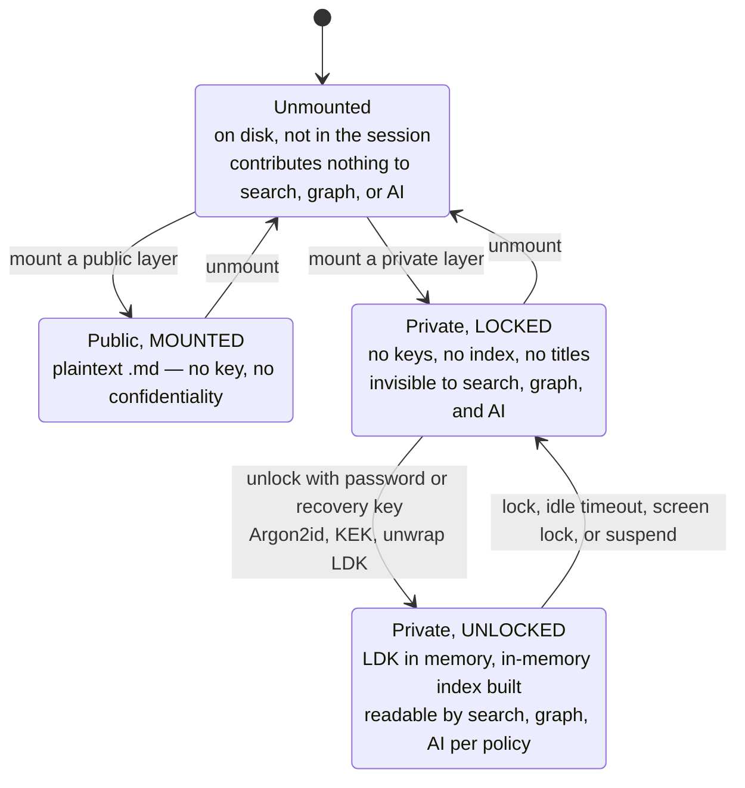
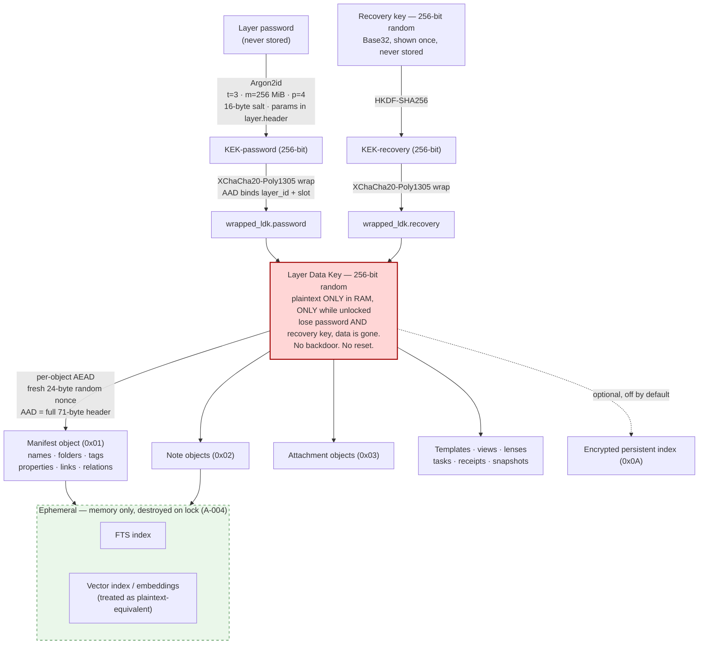
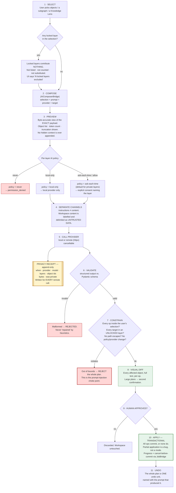

# Strata — System Architecture

Version 0.1.0. **M0 and M1 are implemented**; everything tagged M2+ is design.

Related: [storage-layout.md](storage-layout.md) · [encryption-format.md](../security/encryption-format.md) ·
[THREAT_MODEL.md](../../THREAT_MODEL.md) · [glossary.md](../product/glossary.md)

---

## 1. Shape of the system

Strata is a **single desktop process**. There is no server, no localhost port, and no origin to talk
to. Python owns the truth, the keys, and the disk. The renderer draws.

| Half | What it is | What it is allowed to do |
| --- | --- | --- |
| **Python** (PySide6 / Qt 6) | Domain model, storage, crypto, search, graph, AI orchestration, jobs | Everything. Holds the keys. This is the trusted side. |
| **Renderer** (Qt WebEngine + React) | The entire UI: editor, graph, views, composer | Draw, and send schema-validated JSON over the bridge. **No keys, no crypto, no filesystem, no shell, no arbitrary network.** |

The two halves meet at exactly one place — the **QWebChannel bridge** — and that meeting point is the
primary trust boundary of the product. Everything about the architecture follows from wanting that
boundary to be small, enumerable, and greppable.

### 1.1 Container diagram



**Read the diagram for what is *missing*:** there is no arrow from the renderer to the disk, to the
keychain, to a provider, or to the network. Every one of those has to go through the bridge, and the
bridge does not offer a generic way to ask for them.

### 1.2 Why `strata://` and not a localhost server

A localhost HTTP server would open a **listening TCP port** on the user's machine, reachable by any
other local process — including a browser tab on any website. Putting a network listener in front of a
bridge that can read your notes is not a trade we are willing to make. The custom scheme handler serves
bytes from `frontend/dist` **in-process**, gives us a real opaque origin (so CSP and module semantics
behave), works with no network at all, and is a single choke point where path normalization and MIME
types are enforced. See [A-006](../../ASSUMPTIONS.md).

---

## 2. The bridge

### 2.1 The eleven objects

One `QObject` per feature, not one god object with a `call(method, args)` dispatcher — because a
generic dispatcher makes the attack surface "whatever is in the dispatch table", while enumerated slots
make it something you can grep for and audit ([A-007](../../ASSUMPTIONS.md)).

| Bridge | Responsibility | M |
| --- | --- | --- |
| `WorkspaceBridge` | Create/open/close a workspace; list layers | M1 |
| `LayerBridge` | Mount/unmount, lock/unlock, create private layer, password change, key rotation | M1 / M3 |
| `NotesBridge` | Object CRUD, body read/write, links, backlinks | M2 |
| `GraphBridge` | Graph queries, layout jobs, Knowledge Lens | M6 |
| `SearchBridge` | FTS + semantic queries, index status | M5 |
| `AIComposerBridge` | Context selection, payload preview, provider calls, plan generation | M7 |
| `ExportBridge` | Export to Markdown/bundle/clipboard; privacy receipts | M7 / M10 |
| `CollaborationBridge` | Sessions, sharing modes, revocation | M9 |
| `SettingsBridge` | Preferences, per-layer AI policy, theme, accessibility | M1 |
| `SnapshotBridge` | Take/list/restore snapshots | M10 |
| `JobBridge` | **Outbound only** — a Qt Signal carrying JSON: progress, completion, events. Plus `cancel(jobId)`. | M1 |

`JobBridge` is the *only* push channel. The frontend never polls, and we never widen a request method
to smuggle progress back.

### 2.2 The envelope

```jsonc
// request
{ "v": 1, "requestId": "<uuid>", "payload": { /* method-specific */ } }

// success
{ "v": 1, "requestId": "<uuid>", "ok": true, "data": { /* method-specific */ } }

// failure
{ "v": 1, "requestId": "<uuid>", "ok": false,
  "error": { "code": "<closed enum>", "message": "human-readable",
             "retryable": false, "details": { /* structured, safe */ } } }
```

Closed error enum — nothing else may ever appear in `error.code`:

`invalid_request` · `payload_too_large` · `not_found` · `permission_denied` · `layer_locked` ·
`conflict` · `unsupported` · `cancelled` · `provider_error` · `internal`

**Rules the bridge enforces, in order, before anything happens:**

1. Size — reject > **1 MiB** with `payload_too_large`. Rejected *before* parsing, never partially
   processed.
2. Shape — envelope structure, `v == 1`, well-formed `requestId`.
3. Schema — Pydantic model for that specific method. Unknown fields are rejected, not ignored.
4. Only then: side effects.

Production responses carry **no stack traces and no filesystem paths**. An `internal` error returns a
generic message; the detail is logged locally ([FR-170](../../PRODUCT_REQUIREMENTS.md)).

### 2.3 Request sequence

A call that hits a locked layer, and one that runs long enough to become a job.



Two properties worth naming:

- **`layer_locked` is a wall, not a hint.** The service does not confirm the object exists, does not
  return its type, and does not return a title. A locked layer answers nothing.
- **The UI thread never blocks.** Anything that could take more than a frame becomes a job with a
  `jobId`, progress, and cancellation ([FR-190](../../PRODUCT_REQUIREMENTS.md)).

---

## 3. Layers and keys

### 3.1 Layer states



A private layer arrives at **Locked**, not Unlocked, when it is mounted. Mounting makes a layer
*present*; unlocking makes it *readable*. Mounted-but-locked is the normal resting state.

Locking is not a UI state. It **destroys derived state**: keys zeroized where the runtime permits,
in-memory index closed, editor buffers/previews/thumbnails/graph labels cleared, AI context dropped,
in-flight AI operations for that layer cancelled ([FR-011](../../PRODUCT_REQUIREMENTS.md)).

### 3.2 Key hierarchy



Password change = **rewrap the envelope only** (the LDK does not change, objects are untouched).
Key rotation = **new LDK + re-encrypt every object**, as a resumable background job. Full procedures:
[encryption-format.md §6](../security/encryption-format.md).

---

## 4. AI operation-plan flow

AI **never writes to the workspace**. It proposes a plan; a human approves it; Python applies it
transactionally. This is the architectural answer to prompt injection ([T-16](../../THREAT_MODEL.md)):
the model has **no capabilities** — no tools, no filesystem, no network, no way to act. The worst a
malicious note can do is cause a *proposal* that a human then reads in a diff.



**Where each defence sits, and what it actually buys:**

| Stage | Defends against | Honest limit |
| --- | --- | --- |
| Locked-layer exclusion (1) | AI reading material you locked | None. This one is absolute. |
| Byte-accurate preview (3) | Hidden context, silent truncation | The user has to actually look. |
| Per-layer policy (3) | Accidental exfiltration by a permissive default | A user can set `allow`. |
| Instruction/content separation (4) | Injected text being read as an instruction | Reduces, does not eliminate. Models can still be persuaded. |
| Privacy receipt (5) | Silent egress; "did I ever send that?" | Records what left. Cannot recall it. |
| Schema validation (6) | Malformed/hostile output becoming an operation | Only catches *malformed*, not *malicious-but-well-formed*. |
| **Selection constraint (7)** | **Injected instructions reaching objects outside the selection** | **The strongest control here.** An injected "read every note and put it in a link" has no channel: the model cannot call anything, and a plan touching an unselected object is rejected outright. |
| Visual diff + approval (8, 9) | Everything that got past the above | **A human who approves without reading.** This is the real residual risk, and no amount of engineering closes it. |
| Transactional apply (10) | Half-applied, inconsistent workspaces | — |
| Undo (11) | Regret | — |

**We do not claim prompt injection is solved.** Nobody has solved it. We have made the model
*incapable of acting*, which converts an injection from a compromise into a bad suggestion.

---

## 5. Threading and jobs

| Thread | Runs |
| --- | --- |
| **Qt main / UI thread** | Event loop, bridge slots (validate + delegate + return; never do work). |
| **Job worker threads** | Indexing, graph layout, encryption and key rotation, import/export, snapshots, AI calls. |

Every job: has a `jobId`, reports progress via the `JobBridge` signal, is **cooperatively cancellable**,
and is **resumable** where it touches disk (rotation, index rebuild, import). Blocking the Qt event loop
is a bug, not a performance issue — it is the difference between "imperceptible typing latency"
([NFR-010](../../PRODUCT_REQUIREMENTS.md)) and an application that stutters while it thinks.

---

## 6. Data flow: where plaintext is allowed to exist

| Location | Private-layer plaintext allowed? |
| --- | --- |
| Python process memory (while unlocked) | **Yes.** This is the only place. |
| Renderer memory (a note you have open) | **Yes**, for what is on screen. Cleared on lock. |
| Bridge JSON in transit | **Yes** (in-process, never a socket). |
| Object files on disk | **No.** Ciphertext only. |
| Search / vector index on disk | **No** by default; encrypted if the persistent-index flag is on. |
| Temp files, thumbnail caches, export staging | **No. Never.** If an OS API demands a file path, the feature is disabled for private layers ([FR-171](../../PRODUCT_REQUIREMENTS.md)). |
| Logs, crash reports | **No.** Never content, never paths, never keys. |
| The clipboard | Only on an explicit user copy — and the clipboard is an unprotected OS resource ([T-13](../../THREAT_MODEL.md)). |
| Network | Only in a user-approved AI payload, which produces a receipt. |

`scripts/scan_plaintext.py` enforces the "No" rows in CI ([storage-layout.md](storage-layout.md)).

---

## 7. Frontend structure

| Layer | Rule |
| --- | --- |
| `bridge/` | The **only** code that touches `QWebChannel`. Builds envelopes, correlates `requestId`, maps the error enum to typed failures, subscribes to `JobBridge`. |
| `stores/` (Zustand) | **View state only.** Not a cache of truth. Python is the truth. |
| `features/` | Feature modules: view + hooks. Orchestrates bridge calls. |
| `components/` | Presentational. No domain decisions. |

**No business logic in React.** Not a style preference — a security boundary. The renderer is
semi-trusted (it parses untrusted Markdown and untrusted model output). Any check it performs is
**advisory**, and every one of them is enforced *again* in Python. A permission check that exists only
in TypeScript is not a permission check.

**No crypto in JavaScript.** Not a hash, not a nonce, not a key.
