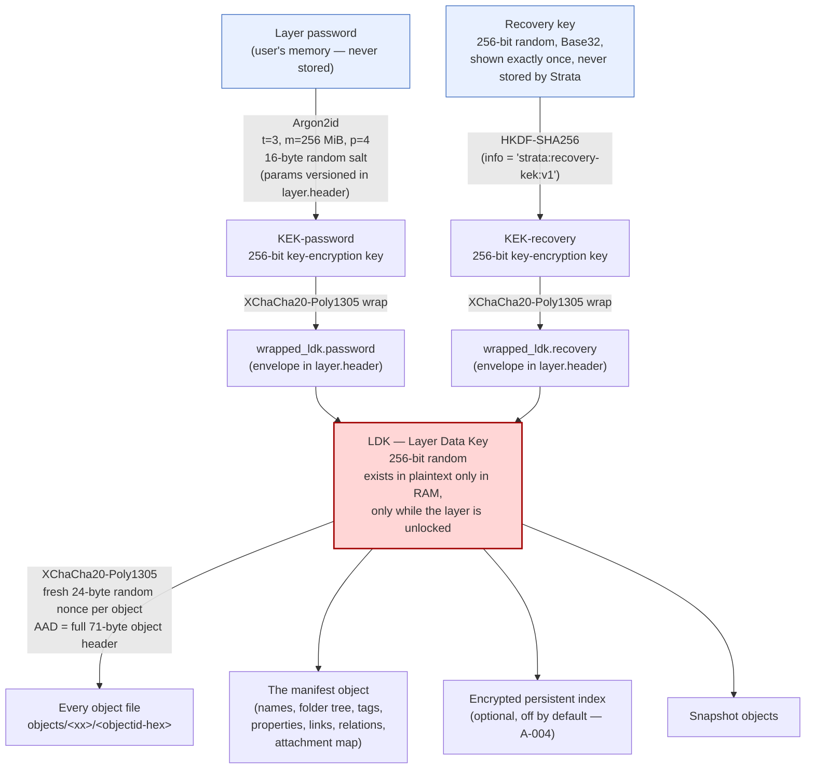

# Strata Encryption Format — v1

**Status: specified, not implemented.** This lands in **Milestone 3**. It is published now so that the
design can be reviewed and attacked before any code depends on it.

This document is normative. It is precise enough to write an independent reader from, and that is
deliberate: a local-first tool whose storage format is undocumented is a lock-in trap
([A-013](../../ASSUMPTIONS.md)).

Related: [THREAT_MODEL.md](../../THREAT_MODEL.md) · [storage-layout.md](../architecture/storage-layout.md)

---

## 1. Primitives

| Purpose | Algorithm | Notes |
| --- | --- | --- |
| Object & key-wrap AEAD | **XChaCha20-Poly1305** | libsodium via PyNaCl. 24-byte nonce, 16-byte Poly1305 tag. |
| Password KDF | **Argon2id** | `argon2-cffi`. Parameters versioned and stored in `layer.header`. |
| Randomness | OS CSPRNG | `os.urandom` / `nacl.utils.random`. Nothing else, ever. |
| Encoding of ids in filenames | lowercase hex | |
| Encoding of the recovery key | Base32 (RFC 4648, uppercase, no padding), grouped | |

**Conventions.** All multi-byte integers are **little-endian** and **unsigned**. All lengths are in
bytes. Byte offsets are zero-based and inclusive of the start.

**Why XChaCha20 and not AES-GCM:** a 192-bit nonce is large enough that a *random* nonce per encryption
is safe with no counter, no nonce database, and no state to keep consistent across crashes, restores,
and snapshots. A nonce counter that a restore-from-backup can rewind is a catastrophic-failure mode we
refuse to build. See [A-002](../../ASSUMPTIONS.md).

---

## 2. Key hierarchy



**The two invariants of this diagram:**

1. **Both wrap paths reach the same LDK.** The password and the recovery key are *independent*
   unwrapping routes to one key. That is what makes password change a **rewrap** (cheap — one small
   envelope rewritten) rather than a re-encryption of every object.
2. **The LDK never touches disk in plaintext, and the password and recovery key never touch disk at
   all.** Losing both means the data is unrecoverable. There is no backdoor, no escrow, and no reset.
   That is the design working, not the design failing.

---

## 3. Object container

Every knowledge object in a private layer is a standalone file. It can be decrypted with nothing but
the LDK and its own bytes — no external index, no shared state, no ordering dependency. A corrupt
object costs you exactly one object.

### 3.1 Layout

```
 offset  size   field                 notes
 ------  -----  --------------------  ----------------------------------------------------------
      0      7  magic                 ASCII "STRATA1"  = 53 54 52 41 54 41 31
      7      1  format_version  u8    1
      8      1  alg             u8    1 = XChaCha20-Poly1305 (see §3.3)
      9      1  object_type     u8    see §3.4
     10      1  flags           u8    bitfield, see §3.5
     11     16  layer_id              random 128-bit layer identifier
     27     16  object_id             random 128-bit object identifier
     43     24  nonce                 24 random bytes from the CSPRNG, unique per encryption
     67      4  plaintext_len   u32   TRUE plaintext length, before padding (little-endian)
 ------  -----  --------------------  ----------------------------------------------------------
     71  = HEADER, 71 bytes. Authenticated as AAD. NOT encrypted.
 ------  -----  --------------------  ----------------------------------------------------------
     71      N  ciphertext            N = padded_len (see §3.6)
   71+N     16  tag                   Poly1305 authentication tag
```

Total file size = `71 + padded_len + 16`.

Everything that identifies the object is in the **cleartext, authenticated** header. Nothing in the
header is a secret: `layer_id` and `object_id` are random values that mean nothing without the
manifest, and `object_type` is coarse. Their job is not to be hidden — it is to be **bound**, so that a
ciphertext cannot be moved.

### 3.2 AAD construction — the anti-transplant control

> **AAD = the entire 71-byte header, verbatim, bytes `[0, 71)`.**

```python
aad = file_bytes[0:71]   # magic || format_version || alg || object_type || flags
                         # || layer_id || object_id || nonce || plaintext_len

ciphertext_and_tag = crypto_aead_xchacha20poly1305_ietf_encrypt(
    message=padded_plaintext,
    aad=aad,
    nonce=nonce,
    key=ldk,
)
```

Because the AAD covers `layer_id`, `object_id`, `object_type`, and `format_version`, the ciphertext is
**cryptographically bound to its identity and its context**. This defeats
[T-32](../../THREAT_MODEL.md) directly:

| Attack | Result |
| --- | --- |
| Copy an object file from layer A into layer B (even with the same LDK) | The reader computes the AAD from the file it found, but validates `layer_id` against the layer it is opening. Mismatch → **reject before decrypting**. Even if the check were skipped, the tag verifies against the *stored* header, so the attacker would have to rewrite `layer_id` — which changes the AAD and **breaks the tag**. |
| Swap two object files within a layer (rename `A` → `B`'s filename) | The filename must equal `hex(object_id)`. After the swap it doesn't, so the reader rejects. Rewriting `object_id` in the header to match breaks the tag. **Both doors are locked.** |
| Change `object_type` to make a note be parsed as a manifest (type confusion) | Alters the AAD → **tag verification fails**. |
| Downgrade `format_version` to trigger an old parser | Alters the AAD → **tag verification fails**. |
| Flip a bit anywhere in header, nonce, or ciphertext | **Tag verification fails.** |

**A reader MUST, in this order:**
1. Check `magic == b"STRATA1"`. Otherwise: not a Strata object.
2. Check `format_version` is supported. Otherwise: `unsupported`.
3. Check `layer_id` equals the layer being opened. Otherwise: reject (do not attempt decryption).
4. Check `hex(object_id)` equals the filename. Otherwise: reject.
5. AEAD-decrypt with `aad = header[0:71]`.
6. **On authentication failure: fail. Loudly.** Never return partial plaintext, never fall back to a
   different key, never retry with a modified AAD, never continue "best effort". See §7.
7. Strip padding using `plaintext_len` (§3.6), validating it against the decrypted length.

Step 6 is the one that gets quietly softened during a debugging session and then never restored.
`tests/security/` exists to catch that.

### 3.3 `alg` values

| Value | Algorithm |
| --- | --- |
| `0x00` | Reserved — invalid. A reader MUST reject. |
| `0x01` | XChaCha20-Poly1305-IETF (24-byte nonce, 16-byte tag) |
| `0x02`–`0xFF` | Reserved. This byte is the escape hatch for a future AES-GCM/FIPS profile ([A-002](../../ASSUMPTIONS.md)) without a format break. |

### 3.4 `object_type` values

The type is in the clear (and authenticated) so a reader can route a file without a manifest, and so a
repair tool can find the manifest in a damaged layer. It is deliberately **coarse** — it says "this is
a note", never *which* note or what it is about.

| Value | Type |
| --- | --- |
| `0x01` | **Manifest** — names, folder tree, tags, properties, links, relations, attachment map |
| `0x02` | Note (Markdown body) |
| `0x03` | Attachment (binary blob) |
| `0x04` | Template |
| `0x05` | Saved view |
| `0x06` | Knowledge Lens |
| `0x07` | Task |
| `0x08` | Privacy receipt |
| `0x09` | Snapshot descriptor |
| `0x0A` | Index chunk (encrypted persistent index — optional, off by default) |
| `0x0B` | CRDT update (reserved; M9, pending [A-005](../../ASSUMPTIONS.md)) |
| `0x0C`–`0xFF` | Reserved |

### 3.5 `flags` bitfield

| Bit | Meaning when set |
| --- | --- |
| `0` (`0x01`) | Plaintext is compressed (zstd) **before** padding and encryption. |
| `1` (`0x02`) | Plaintext is padded (§3.6). Set for all objects by default. |
| `2` (`0x04`) | Object is tombstoned (deleted; retained for sync convergence / trash). |
| `3`–`7` | Reserved. A reader MUST reject an object with an unknown flag set. |

> **Compression note.** Bit 0 is defined but **off by default**, and it must never be enabled on an
> object whose plaintext mixes attacker-influenced content with secrets: compressing before encrypting
> makes the ciphertext length a function of the plaintext's *content*, which is the CRIME/BREACH
> family of attacks. Padding blunts this but does not eliminate it. Enabling compression requires a
> threat-model review.

### 3.6 Padding

Padding blunts the size side channel ([T-24](../../THREAT_MODEL.md)). It does not eliminate it, and
this document will not pretend that it does.

**Scheme.** Pad the plaintext with **zero bytes** to the next bucket boundary ≥ its true length. The
true length is recorded in the authenticated header (`plaintext_len`), so the padding is unambiguous to
strip and cannot be manipulated by an attacker without breaking the tag. Padding happens **before**
encryption; the ciphertext length is therefore `padded_len` exactly.

**Bucket ladder (v1).**

| Range of true plaintext length | Bucket granularity | Buckets |
| --- | --- | --- |
| 0 – 4 KiB | 256 B | 256, 512, 768, … 4096 |
| 4 KiB – 64 KiB | 4 KiB | 8K, 12K, … 64K |
| 64 KiB – 1 MiB | 64 KiB | 128K, 192K, … 1M |
| 1 MiB – 16 MiB | 1 MiB | 2M, 3M, … 16M |
| > 16 MiB | 16 MiB | round up to the next multiple of 16 MiB |

```python
def padded_length(n: int) -> int:
    for limit, gran in ((4096, 256), (65536, 4096), (1048576, 65536), (16777216, 1048576)):
        if n <= limit:
            return ((n + gran - 1) // gran) * gran or gran
    gran = 16777216
    return ((n + gran - 1) // gran) * gran
```

**What this buys, honestly:** an observer learns your note is "between 3.75 KiB and 4 KiB", not "4,013
bytes". At the low end that is a real reduction in fingerprinting power. At the high end — a 40 MB
video attachment padded to 48 MB — it is nearly worthless, and an attacker can still tell a large
attachment from a small note. **Object count, mtimes, and total layer size are not hidden at all.** See
[THREAT_MODEL.md §5](../../THREAT_MODEL.md).

The ladder is a parameter of the format version. Changing it does not require re-encrypting anything
(readers strip padding by `plaintext_len`, not by rule), so we can tune it in a minor release.

---

## 4. The layer header file — `layer.header`

One JSON file per private layer, at the layer root. It contains **no secrets**: only public parameters
and two envelopes, each of which is an AEAD ciphertext of the LDK under a key derived from something
the user knows or holds.

```jsonc
{
  "magic": "STRATA1",
  "format_version": 1,
  "layer_id": "6f1a2c9d4b8e47f0a3c5d7e9b1f30248",   // 16 bytes, hex — matches every object header
  "created_at": "2026-07-14T10:12:03Z",
  "updated_at": "2026-07-14T10:12:03Z",

  "kdf": {
    "id": "argon2id",
    "version": 19,                    // Argon2 v1.3 == 0x13 == 19
    "params_version": 1,              // Strata's own params generation (see §6.3)
    "t_cost": 3,
    "m_cost_kib": 262144,             // 256 MiB
    "parallelism": 4,
    "salt": "…32 hex chars…",         // 16 random bytes, per layer, NOT per wrap
    "output_len": 32
  },

  "wrapped_ldk": {
    "password": {
      "alg": "xchacha20poly1305",
      "nonce": "…48 hex chars…",      // 24 bytes, random, unique per wrap operation
      "ciphertext": "…96 hex chars…", // 32-byte LDK + 16-byte tag = 48 bytes
      "aad": "strata:ldk-wrap:v1:password:<layer_id>",
      "wrapped_at": "2026-07-14T10:12:03Z"
    },
    "recovery": {
      "alg": "xchacha20poly1305",
      "nonce": "…48 hex chars…",
      "ciphertext": "…96 hex chars…",
      "aad": "strata:ldk-wrap:v1:recovery:<layer_id>",
      "wrapped_at": "2026-07-14T10:12:03Z"
    }
  },

  "kdf_check": "…",                   // optional: HMAC-SHA256(KEK, "strata:kdf-check:v1")
                                      // lets us distinguish "wrong password" from "corrupt file"
                                      // WITHOUT revealing anything about the LDK

  "anti_rollback_counter": 41,        // monotonic; see §8 and T-20
  "sharing_mode": "personal",         // personal | shared-password | identity-managed
  "padding_profile": 1,
  "manifest_object_id": "…32 hex chars…",

  "header_mac": "…64 hex chars…"      // HMAC-SHA256 over the canonical JSON of every field above,
                                      // keyed by a subkey of the LDK. Verified after unwrap.
}
```

**Notes on the header:**

- `wrapped_ldk.recovery` is **absent** if the user declined a recovery key.
- The **AAD strings are literal** and include the layer id, so a wrapped-LDK envelope cannot be
  transplanted between layers or between the password and recovery slots.
- The `salt` is per **layer**, not per wrap. Both KEK derivations for the password path use it; the
  recovery path does not use Argon2id at all (the recovery key already has full entropy — running a
  memory-hard KDF over 256 random bits protects against nothing and only slows unlock).
- `header_mac` is verified **after** the LDK is unwrapped, and it authenticates the public parameters —
  so an attacker cannot silently downgrade `m_cost_kib` to 8 KiB and then hand you the file back for a
  cheap offline crack. Note the ordering limitation, stated plainly: an attacker *can* tamper with the
  KDF params of a file you have not yet opened, and you would perform one expensive-or-cheap derivation
  before the MAC check fails. The MAC catches the tampering; it cannot prevent you from computing one
  KDF against forged params. Since a wrong-params derivation cannot unwrap the LDK, this is a
  denial-of-service, not a disclosure.
- The header file is written **atomically** (temp + fsync + rename) and is backed up to
  `layer.header.bak` before every rewrite. Losing this file loses the layer.

---

## 5. Unlock

```
1.  Read layer.header. Validate magic + format_version.
2.  Password path:  KEK = Argon2id(password, salt, t, m, p, 32)
    Recovery path:  KEK = HKDF-SHA256(recovery_key_bytes, info="strata:recovery-kek:v1", 32)
3.  (Optional fast check) verify kdf_check → distinguishes a wrong password from a corrupt file.
4.  LDK = XChaCha20-Poly1305-decrypt(wrapped_ldk.<path>, key=KEK, aad="strata:ldk-wrap:v1:<path>:<layer_id>")
    Authentication failure → WRONG PASSWORD or TAMPERED FILE. Nothing is learned about the LDK.
5.  Verify header_mac with a subkey of the LDK.  Mismatch → the header was tampered with → refuse.
6.  Zeroize KEK. It is not needed again until a password change.
7.  Load and decrypt the manifest object (object_type 0x01, id = manifest_object_id).
8.  Build the in-memory FTS/vector index (A-004). Layer state → unlocked.
```

**On lock** ([FR-011](../../PRODUCT_REQUIREMENTS.md)): zeroize the LDK and every derived subkey *where
the runtime permits*; close and discard the in-memory index; clear decrypted editor buffers, previews,
thumbnails, and graph labels; drop AI context; cancel in-flight AI operations touching the layer.

> **Zeroization, honestly.** Python cannot guarantee that a secret is gone. `bytes` are immutable and
> the allocator, the garbage collector, and the OS may all have made copies. We hold key material in
> `bytearray`/libsodium-backed buffers and overwrite them, and libsodium's `mlock` is used where the OS
> permits — but **we do not claim key material is reliably erased from RAM.** See
> [T-04](../../THREAT_MODEL.md).

---

## 6. Key lifecycle

### 6.1 Password change — **rewrap only**

Changing a password does **not** re-encrypt a single object. The LDK is unchanged.

```
1.  Unlock with the old password → LDK (in memory).
2.  new_salt  = 16 random bytes
    new_KEK   = Argon2id(new_password, new_salt, current_params)
3.  new_envelope = XChaCha20-Poly1305-encrypt(LDK, key=new_KEK, nonce=<24 fresh random bytes>,
                                              aad="strata:ldk-wrap:v1:password:<layer_id>")
4.  Write layer.header atomically with the new salt + new envelope. Bump updated_at.
5.  Zeroize old_KEK and new_KEK.
```

Cost: milliseconds plus one KDF. The recovery envelope is untouched and still works.

**This is why password change is fast — and it is also why it does not help if your old password was
already compromised *and* an attacker already copied your disk.** They still hold a file wrapped under
the old password. Changing your password protects future copies, not past ones. If you believe the LDK
itself is exposed, you need §6.2.

### 6.2 Key rotation — new LDK, re-encrypt everything

Required after a collaborator revocation ([FR-124](../../PRODUCT_REQUIREMENTS.md)), or whenever the LDK
may have been exposed.

```
1.  Unlock → old_LDK.
2.  new_LDK = 32 random bytes.
3.  For every object in the layer (as a resumable background job with progress via JobBridge):
      plaintext = decrypt(obj, old_LDK)
      write NEW object file with:
        - the SAME object_id  (identity is stable — links and the manifest stay valid)
        - a FRESH random nonce
        - AAD recomputed over the new header
        - ciphertext under new_LDK
      Write to a temp path, fsync, then atomically rename over the old file.
4.  Re-wrap new_LDK under the password KEK and the recovery KEK. Write layer.header atomically.
5.  Bump anti_rollback_counter. Zeroize old_LDK.
```

**Interruption is safe.** The job is resumable: an object is either fully old or fully new (atomic
rename), and the layer header still holds the old LDK until step 4. Rotation therefore keeps a
**dual-key read window**: a reader tries the new LDK, and on authentication failure falls back to the
old LDK *only while a rotation is recorded as in progress*. That fallback is the one place where an
authentication failure is not immediately fatal, it is explicitly scoped, and it is deleted from the
header the moment rotation completes.

**Say this out loud in the UI:** rotation gives a revoked collaborator no *future* access. It does not
retract what they already read ([T-25](../../THREAT_MODEL.md)). You cannot un-share a secret.

### 6.3 Raising KDF cost

`kdf.params_version` lets a future release ship stronger defaults. On the next successful unlock, if
`params_version < current`, Strata offers to re-derive and rewrap under the new parameters (the LDK
never changes; §6.1). We **offer**; we do not silently make the user's unlock four times slower.

---

## 7. Corruption and authentication failure

An AEAD authentication failure means exactly one of: **corruption**, **tampering**, or **the wrong
key**. Strata cannot distinguish them cryptographically, and it will not guess.

| Situation | Behaviour |
| --- | --- |
| Bad tag on the wrapped LDK | Reported as **"wrong password or recovery key"** (the overwhelmingly common cause). `kdf_check`, when present, disambiguates a wrong password from a corrupt header without leaking anything about the LDK. |
| Bad tag on an object | Reported as **corruption or tampering** of that specific object. The object is quarantined, not deleted. The rest of the layer opens normally — this is precisely why objects are encrypted independently. |
| Bad `header_mac` | **Refuse to open the layer.** The parameters have been tampered with. This is not recoverable by retrying. |
| `layer_id` mismatch, or filename ≠ `hex(object_id)` | Reject **before** decrypting. Do not attempt the key. |
| Unknown `format_version`, `alg`, `object_type`, or an unknown `flags` bit | `unsupported`. **Do not** attempt a best-effort parse. |
| Truncated file (< 87 bytes, or shorter than `71 + padded_len + 16`) | Corrupt. Reject. |
| Decrypted length ≠ `padded_len`, or `plaintext_len > padded_len` | Corrupt (or a broken writer). Reject. |

**Absolute rules:**
- **Never** return partial plaintext from a failed decryption.
- **Never** retry with a different key, a different AAD, or a relaxed check to "make it work" — outside
  the one explicitly-scoped rotation window in §6.2.
- **Never** log the plaintext, the key, or the ciphertext when reporting a failure.
- Surface the failure to the user. A silently-swallowed authentication error is how a tampered
  workspace becomes a trusted one.

Recovery paths: restore the object from a **snapshot**, or from a backup (`layer.header.bak` for the
header). Strata will not "repair" a ciphertext, because a ciphertext that fails authentication contains
no trustworthy information.

---

## 8. Versioning and migration

| Field | Governs | Break policy |
| --- | --- | --- |
| `magic` (`STRATA1`) | The container family | A change here means a **new, incompatible format**, and a new magic (`STRATA2`). Never silently reuse `STRATA1`. |
| `format_version` (u8, in every object header) | The object container layout | Bump on any layout change. Readers reject versions they do not know. Authenticated via the AAD, so it cannot be downgraded by an attacker. |
| `alg` (u8) | The AEAD | New algorithm ⇒ new `alg` value. Objects with different `alg` values can coexist during a migration. |
| `kdf.params_version` | Argon2id cost defaults | Bump freely; rewrap on next unlock (§6.3). Does not affect objects. |
| `padding_profile` | The bucket ladder | Bump freely; **no re-encryption needed** (padding is stripped by `plaintext_len`, not by rule). |
| `anti_rollback_counter` | Monotonic layer state | Increments on rotation and on snapshot commit. A decrease requires an explicit, warned user override ([T-20](../../THREAT_MODEL.md)). |

**Migration rules.**
1. **Readers reject what they do not understand.** No best-effort parsing of an unknown version. Ever.
2. A version bump ships with a migration that is **resumable** and **non-destructive**: write the new
   object, fsync, atomically rename, and only then consider the old one gone.
3. **A snapshot is taken before any migration begins**, automatically, without asking.
4. Objects of mixed `format_version` may coexist within a layer during a migration. The manifest is
   migrated **last**, so an interrupted migration leaves a layer that still opens.
5. Every format change requires an **ADR** (`docs/adr/`) and an update to this document **in the same
   PR** ([CONTRIBUTING.md](../../CONTRIBUTING.md)).

---

## 9. Known-answer test vectors

**TODO (M3).** Before this format is implemented, `tests/fixtures/` must contain frozen KATs:
a fixed LDK, a fixed nonce, a fixed header, and the expected ciphertext and tag — so that any future
refactor that silently changes what we write to disk fails a test instead of corrupting a workspace.

KATs are also the artifact that makes an **independent reader** possible. That is the point: you should
never have to trust this app to get your notes back.
