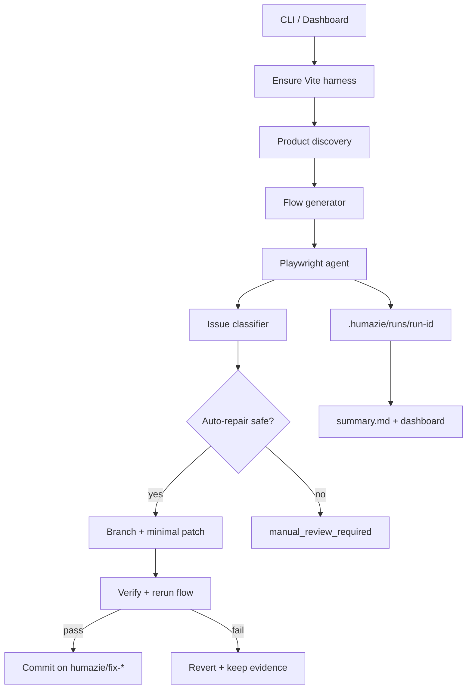

# Humazie Bot architecture

## Context

Strata is **not** a Next.js multi-route web app. It is:

- Python / PySide6 desktop host
- React 18 + Vite SPA embedded in Qt WebEngine
- Mode-based navigation (`focus` | `explore` | `views` | `command`)
- All privileged I/O through QWebChannel

Humazie adapts the requested review loop to that reality.

## Packages

```
humazie/
  src/
    discovery/     # static + runtime product map
    flows/         # product-specific flow generator
    browser/       # Playwright execution agent
    issues/        # classification + human-like heuristics
    repair/        # root-cause hints + safe auto-fix
    verification/  # lint/type/test/flow gates + rollback
    logging/       # run folders + JSONL actions
    report/        # Markdown summary
    db/            # Prisma/SQLite run history (optional)
    cli.ts         # discover | review | rerun | report
  dashboard/       # Next.js App Router UI + API routes
  prisma/          # SQLite schema
frontend/
  humazie.html
  src/humazie-entry.tsx   # installs fakeBridge, mounts App
```

## Data flow



## Run artifacts

Each review writes:

- `run.json`, `product-map.json`, `flows.json`, `actions.jsonl`
- `issues.json`, `fixes.json`, `summary.md`
- `screenshots/`, `videos/`, `traces/`, `patches/`, `console/`, `network/`

## Safety rules

Encoded in `repair/safety.ts` and `humazie.config.ts`:

- Confidence threshold
- Max files / lines
- Block crypto/auth/packaging/CI paths
- Never weaken validation to green a test
- Prefer accessible selectors over CSS

## Phases

| Phase | Capability |
| --- | --- |
| 1 | Discovery, flows, Playwright logging, screenshots/traces, Markdown report |
| 2 | Console/network monitors, a11y (axe), product map persistence, SQLite history |
| 3 | Root-cause file hints, safe auto-fix, verification, git branch/commit, rollback |
| 4 | Next.js dashboard, start/rerun APIs, issue status distinctions |
